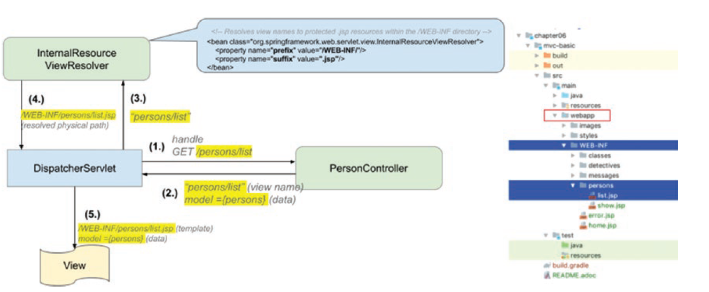

Центральный компонент - DispatcherServlet. Он обрабатывает http запросы, конвертируя их в команды и посылая контроллерам
В spring mvc есть предопределённые бины, и они находятся в spring-web.jar spring-webmvc.jar.
The application context создаётся и инжектится в DispatcherServlet. Сервлет лиснер используется для запуска и остановки application context. 
The Spring servlet listener class is org.springframework.web.context.ContextLoaderListener.

Spring MVC infrastructure components
* handler mappings - they map requests to handler methods and a
list of interceptors (e.g., to apply a theme to view and
internationalization)
* handler adapters to invoke a handler method mapped to a
request
* view resolvers to identify a view that will be rendered as response
* personalization beans for theming and internationalization
* exception resolvers, which are special methods that handle
exceptions thrown by handler methods 

User-provided web components
* handler interceptors, which are beans that define functionality to
be applied in tandem with handler method functionality (before,
after, or around)
* controllers, which are beans that provide handler methods

The DispatcherServlet must be defined in the web.xml when the application is
configured using old-style XML configuration. When using configuration without the
web.xml, a configuration class that extends AbstractDispatcherServletInitializer or
AbstractAnnotationConfigDispatcherServletInitializer must be declared. Objects of types implementing this interface are detected automatically by
SpringServletContainerInitializer, which is bootstrapped automatically by any
Servlet 3.0+ environment.

The DispatcherServlet creates a separate “servlet” application context containing
all the specific web beans (controller, views, view resolvers). This context is also called
the web application context or DispatcherServletContext.

The DispatcherServlet looks for implementations of type: HandlerMapping,
HandlerAdapter, ViewResolver, View, HandlerExceptionResolver. Out-of-the-box
implementations for the interfaces are provided by Spring. The default configuration
is found in DispatcherServlet.properties, which is in the spring-webmvc.jar in
package org.springframework.web.servlet

Controllers are classes that define methods used to handle HTTP requests. @Component сканируется
@RequestMapping - помечает каждый хендлер метод

См первый контроллер HomeController

ViewResolver определяет по тому что вернул контроллер, какое view показать. Дефолтный - InternalResourceViewResolver
Дефолты указаны в DispatcherServlet.properties

Если хочется иметь разные вью резолверы, то можно их завести и приоритезировать ViewPrioritisation

ContentNegotiatingViewResolver делегирует другим резолверам и выбирает тот, который подходит
контент типу из (3 стратегии: 1 - url extension, 2 - Accept header set to application/pdf..., 3 - ?type="pdf").
Его можно добавить в приорити чейн, но он должен быть первым см ContentNegotiatingViewResolverConfiguration